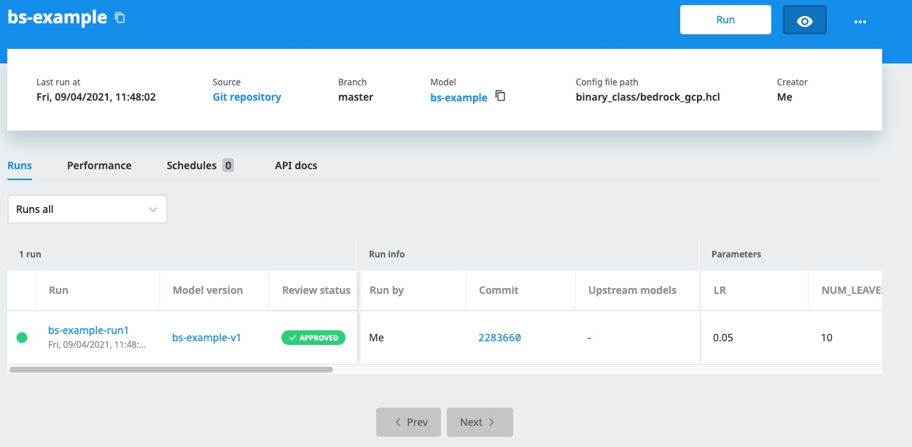

# Batch scoring pipeline tutorial in Google Cloud

This example demonstrates how to use Bedrock to perform batch scoring in a pipeline. 
At the end of the tutorial, the user will be able to
- Set up a batch scoring pipeline in Bedrock
- Save the output in Google BigQuery

## Prerequsites
Train a model with the training pipeline from this [end-to-end example](https://github.com/basisai/examples/tree/master/binary_class)

## Next Steps
After training the model, go to the training pipeline page and click model version. 
Then refer to [Bedrock documentation](https://docs.basis-ai.com/guides/quickstart/next-step-deploy-a-batch-scoring) for details on how to deploy and run a batch scoring pipeline.